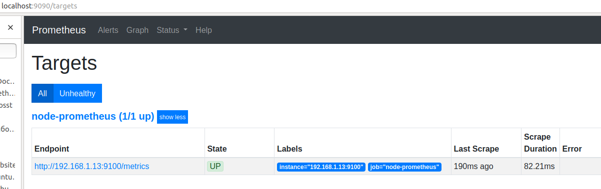

# ДЗ к теме 13.Мониторинг и алертинг

## Установка node exporter

1. Скачивание  
	```
	user@linux1:~$ wget https://github.com/prometheus/node_exporter/releases/download/v0.18.1/node_exporter-0.18.1.linux-amd64.tar.gz
	--2020-04-05 16:42:02--  https://github.com/prometheus/node_exporter/releases/download/v0.18.1/node_exporter-0.18.1.linux-amd64.tar.gz
	Resolving github.com (github.com)... 140.82.118.4
	Connecting to github.com (github.com)|140.82.118.4|:443... connected.
	...
	Saving to: ‘node_exporter-0.18.1.linux-amd64.tar.gz’

	node_exporter-0.18. 100%[===================>]   7,71M  1,34MB/s    in 6,7s    

	2020-04-05 16:42:11 (1,15 MB/s) - ‘node_exporter-0.18.1.linux-amd64.tar.gz’ saved [8083296/8083296]
	```
2. Развертывание  
	```
	user@linux1:~$ tar xf node_exporter-0.18.1.linux-amd64.tar.gz
	user@linux1:~$ cd node_exporter-0.18.1.linux-amd64
	user@linux1:~/node_exporter-0.18.1.linux-amd64$ sudo cp node_exporter /usr/local/bin
	user@linux1:~/node_exporter-0.18.1.linux-amd64$ sudo useradd --no-create-home --home-dir / --shell /bin/false node_exporter
	```
3. Создаём systemd-юнит node_exporter.service в папке /etc/systemd/system/ (Важно! Если /home вынесен на отдельный раздел, директиву ProtectHome=yes надо убрать, иначе node exporter будет неправильно показывать оставшееся место на разделе /home.) :
	```
	user@linux1:~/linux/homework-11$ cat /etc/systemd/system/node_exporter.service
	[Unit]
	Description=Prometheus Node Exporter
	After=network.target

	[Service]
	Type=simple
	User=node_exporter
	Group=node_exporter
	ExecStart=/usr/local/bin/node_exporter

	SyslogIdentifier=node_exporter
	Restart=always

	PrivateTmp=yes
	ProtectHome=yes
	NoNewPrivileges=yes

	ProtectSystem=strict
	ProtectControlGroups=true
	ProtectKernelModules=true
	ProtectKernelTunables=yes

	[Install]
	WantedBy=multi-user.target
	user@linux1:~/linux/homework-11$ 
	```
4. Запускаем node exporter:  
	```
	user@linux1:~/node_exporter-0.18.1.linux-amd64$ sudo systemctl daemon-reload
	user@linux1:~/node_exporter-0.18.1.linux-amd64$ sudo systemctl start node_exporter
	user@linux1:~/node_exporter-0.18.1.linux-amd64$ sudo systemctl status node_exporter
	● node_exporter.service - Prometheus Node Exporter
	   Loaded: loaded (/etc/systemd/system/node_exporter.service; disabled; vendor p
	   Active: active (running) since Sun 2020-04-05 17:11:11 +04; 13s ago
	 Main PID: 18036 (node_exporter)
	    Tasks: 5 (limit: 4915)
	   CGroup: /system.slice/node_exporter.service
		   └─18036 /usr/local/bin/node_exporter
	```
5. Можем проверить получение метрик по адресу http://localhost:9100/metrics  
	```
	user@linux1:~/node_exporter-0.18.1.linux-amd64$ curl -s http://localhost:9100/metrics
	# HELP go_gc_duration_seconds A summary of the GC invocation durations.
	# TYPE go_gc_duration_seconds summary
	go_gc_duration_seconds{quantile="0"} 0
	go_gc_duration_seconds{quantile="0.25"} 0
	go_gc_duration_seconds{quantile="0.5"} 0
	go_gc_duration_seconds{quantile="0.75"} 0
	go_gc_duration_seconds{quantile="1"} 0
	go_gc_duration_seconds_sum 0
	go_gc_duration_seconds_count 0
	# HELP go_goroutines Number of goroutines that currently exist.
	# TYPE go_goroutines gauge
	go_goroutines 7
	...
	```
## Развертывание стенда prometheus и grafana

6. Теперь развернем предложенный на занятии стенд с установленным prometheus и grafana, только изменим целевую машину с гостевой на реальный хост в файле конфигурации prometheus.yml: - targets:['192.168.1.13:9100']. После развертывания убедимся, что по адресу http://localhost:9090 доступен Prometheus, а по адресу http://localhost:3000 - Grafana. На на странице http://localhost:9090/targets появился первый таргет. Он находится в состоянии “UP”.  


7. Далее настроим интерфейс Grafana по адресу http://localhost:3000. Логинимся (admin:admin). Нажимаем на боковой панели Configuration (шестерёнка) → Data Sources и  добавляем наш Prometheus. В настройках URL прописываем ссылку полностью 'http://localhost:9090' (без 'http://' не хочет принимать адрес)  

8. Теперь добавим готовый дашборд Node exporter full. Для этого нажимаем в панели слева пиктограмму квадрата (Dashboards) → Manage → Import. Вписываем 1860 в поле 'Grafana.com Dashboard' и убираем курсор из поля ввода, иначе не начнёт импортировать. Дальше указываем data source и жмём import.  

9. Изменяем заголовок дашборда в настройках Dashboard settings и выбираем/настраиваем нужные нам графики.  


